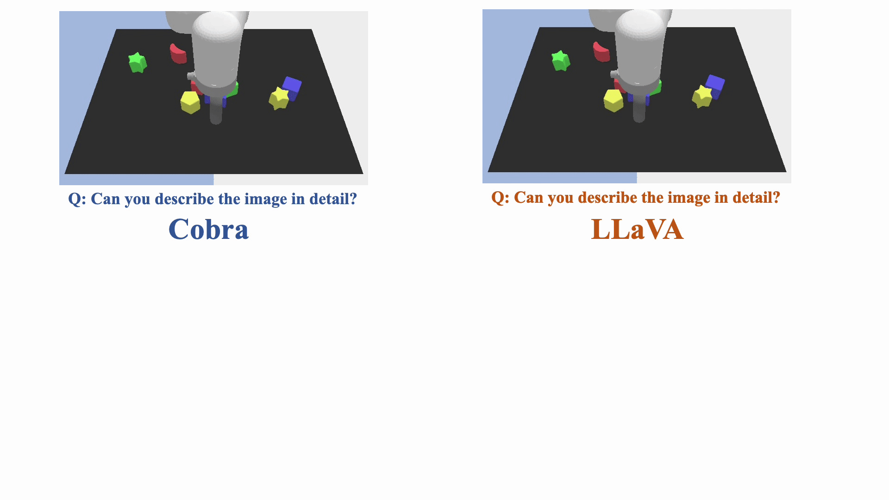

# [AAAI-25] Cobra: Extending Mamba to Multi-modal Large Language Model for Efficient Inference

[](https://arxiv.org/abs/2403.14520)
[](https://huggingface.co/han1997/cobra)
[](https://huggingface.co/spaces/han1997/cobra)


(Generated by SDXL, prompt: A cute cobra with flamming lava in the background, cartoon style)

## Release
[12/10/2024] Cobra got accepted for AAAI-25!

[5/23/2024] A fix for the prompt format, which modifies the abnormal behavior during generation, has been implemented. Make sure you use the newest [checkpoint](https://huggingface.co/han1997/cobra) to adapt to the new prompt format!

[5/18/2024] The [evaluation](https://github.com/h-zhao1997/vlm-evaluation) code has been uploaded!

[3/27/2024] An intuitive demo, showcasing the generation speed of our Cobra model and LLaVA v1.5.


[3/24/2024] Try our [demo](https://huggingface.co/spaces/han1997/cobra) online!

[3/24/2024] The training and inference codes are released.

[3/24/2024] Our model [weight](https://huggingface.co/han1997/cobra) is available now.

[3/21/2024] The repository is created.

[**Installation**](#installation) | [**Usage**](#usage) | [**Pretrained Models**](#pretrained-models) | [**Training VLMs**](#training-vlms) | [**License**](#license)
---

## Installation

This repository was built using Python 3.10, but should be backwards compatible with any Python >= 3.8. We require PyTorch 2.1 or greater installation instructions [can be found here](https://pytorch.org/get-started/locally/). This repository was developed and has been thoroughly tested with PyTorch 2.1.0 and Torchvision 0.16.0.

Once PyTorch has been properly installed, you can install this package locally via an editable installation (or via
`pip install git+https://github.com/h-zhao1997/cobra`):

```bash
git clone https://github.com/h-zhao1997/cobra
cd cobra
pip install -e .

# install mamba and other packages
pip install packaging ninja
pip install "mamba-ssm<2.0.0"
pip install causal-conv1d

# Verify Ninja --> should return exit code "0"
ninja --version; echo $?
```

If you run into any problems during the installation process, please file a GitHub Issue.

## Usage

Once installed, loading and running inference with pretrained `cobra` models is easy:

```python
import requests
import torch

from PIL import Image
from pathlib import Path

from cobra import load

hf_token = Path(".hf_token").read_text().strip()
device = torch.device("cuda") if torch.cuda.is_available() else torch.device("cpu")
# In case your GPU does not support bf16
dtype = torch.bfloat16 if torch.cuda.is_bf16_supported() else torch.float16

# Load a pretrained VLM (either local path, or ID to auto-download from the HF Hub) 
model_id = "cobra+3b"
vlm = load(model_id, hf_token=hf_token)
vlm.to(device, dtype=dtype)

# Download an image and specify a prompt
image_url = "https://huggingface.co/datasets/huggingface/documentation-images/resolve/main/beignets-task-guide.png"
image = Image.open(requests.get(image_url, stream=True).raw).convert("RGB")
user_prompt = "What is going on in this image?"

# Build prompt
prompt_builder = vlm.get_prompt_builder()
prompt_builder.add_turn(role="human", message=user_prompt)
prompt_text = prompt_builder.get_prompt()

# Generate!
generated_text = vlm.generate(
    image,
    prompt_text,
    use_cache=True,
    do_sample=True,
    temperature=0.4,
    max_new_tokens=512,
)
```

For a complete terminal-based CLI for interacting with our VLMs, check out [scripts/generate.py](scripts/generate.py). 

---

## Training VLMs

#### Pretraining Datasets
The [LLaVa v1.5 Instruct Dataset](https://github.com/haotian-liu/LLaVA/blob/main/docs/Data.md) can be downloaded by the automated download script in [`scripts/preprocess.py`](scripts/preprocess.py):

```bash
# Download the `llava-v1.5-instruct` (Instruct Tuning) Image and Language Data (includes extra post-processing)
python scripts/preprocess.py --dataset_id "llava-v1.5-instruct" --root_dir <PATH-TO-DATA-ROOT>

# (In case you also wish to download the explicit vision-language alignment data)
python scripts/preprocess.py --dataset_id "llava-laion-cc-sbu-558k" --root_dir <PATH-TO-DATA-ROOT>
```

[LVIS-Instruct-4V](https://arxiv.org/abs/2311.07574) and [LRV-Instruct](https://arxiv.org/abs/2306.14565) can also be downloaded by the scripts in [`scripts/additional-datasets`](scripts/additional-datasets).

#### Model Configuration & Training Script
Here's how you would train Cobra follow the training recipe in our paper across 8 GPUs on a single-node: 

```bash
# Run from the root of the repository
torchrun --standalone --nnodes 1 --nproc-per-node 8 scripts/pretrain.py \
  --model.vision_backbone_id "dinosiglip-vit-so-384px" \
  --model.image_resize_strategy "resize-naive" \
  --model.llm_backbone_id "mamba-2.8b-zephyr" \
  --model.type "cobra+3b" \
  --model.finetune_global_batch_size 128 \
  --model.finetune_per_device_batch_size 8 \
  --dataset.type "llava-lvis4v-lrv"
```

---

#### Citation 

If you find our code or models useful in your work, please cite [our paper](https://arxiv.org/abs/2403.14520):

```bibtex
@article{zhao2024cobra,
      title={Cobra: Extending Mamba to Multi-Modal Large Language Model for Efficient Inference}, 
      author={Han Zhao and Min Zhang and Wei Zhao and Pengxiang Ding and Siteng Huang and Donglin Wang},
      year={2024},
      eprint={2403.14520},
      archivePrefix={arXiv},
      primaryClass={cs.CV}
}
```

## License
This project is released under the MIT [License](LICENSE)

## Acknowledgement
We build our project based on
- [Prismatic VLMs](https://github.com/TRI-ML/prismatic-vlms)
- [Mamba](https://github.com/state-spaces/mamba)
- [Transformers](https://github.com/JLTastet/transformers/tree/mamba): the Huggingface Transformers implementation of Mamba
- [LLaVA](https://github.com/haotian-liu/LLaVA): an amazing open-sourced project for vision language assistant
